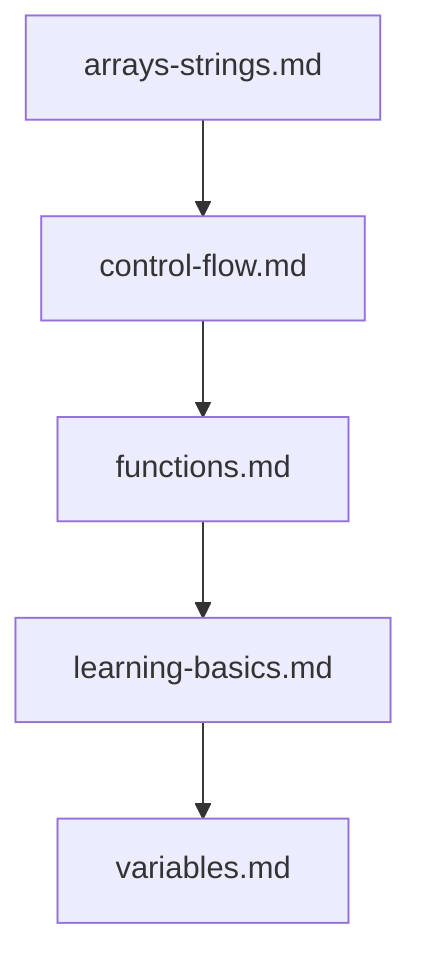

## Folder Map

| Type | Name | Purpose |
| --- | --- | --- |
| File | [arrays-strings.md](arrays-strings.md) | understand arrays strings |
| File | [control-flow.md](control-flow.md) | understand control flow |
| File | [functions.md](functions.md) | understand functions |
| File | [learning-basics.md](learning-basics.md) | understand learning basics |
| File | [variables.md](variables.md) | understand variables |

## Flowchart

# basics

This README is the navigation index for this folder.
## Next Step

- Go to [arrays-strings.md](arrays-strings.md) to understand arrays strings.
