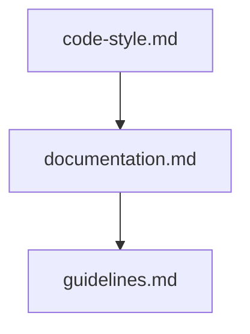

## Folder Map

| Type | Name | Purpose |
| --- | --- | --- |
| File | [code-style.md](code-style.md) | understand code style |
| File | [documentation.md](documentation.md) | understand documentation |
| File | [guidelines.md](guidelines.md) | understand guidelines |

## Flowchart

# contributing

This README is the navigation index for this folder.
## Next Step

- Go to [code-style.md](code-style.md) to understand code style.
