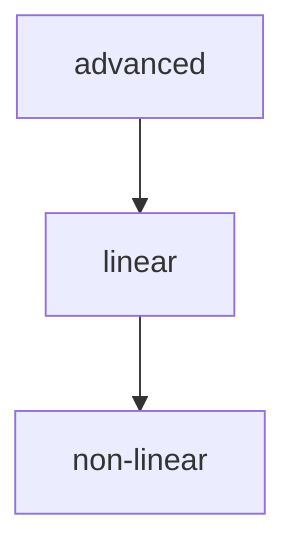

## Folder Map

| Type | Name | Purpose |
| --- | --- | --- |
| Folder | [advanced](advanced/README.md) | continue with the advanced section |
| Folder | [linear](linear/README.md) | continue with the linear section |
| Folder | [non-linear](non-linear/README.md) | continue with the non linear section |

## Flowchart

# data structures

This README is the navigation index for this folder.
## Next Step

- Go to [README.md](advanced/README.md) to understand advanced.
