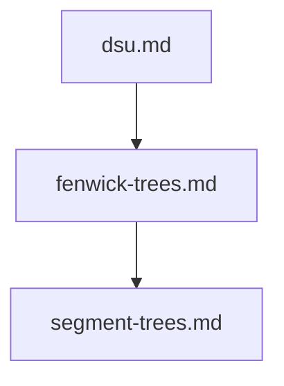

## Folder Map

| Type | Name | Purpose |
| --- | --- | --- |
| File | [dsu.md](dsu.md) | understand dsu |
| File | [fenwick-trees.md](fenwick-trees.md) | understand fenwick trees |
| File | [segment-trees.md](segment-trees.md) | understand segment trees |

## Flowchart

# advanced

This README is the navigation index for this folder.
## Next Step

- Go to [dsu.md](dsu.md) to understand dsu.
