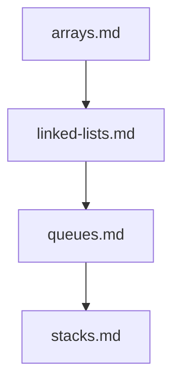

## Folder Map

| Type | Name | Purpose |
| --- | --- | --- |
| File | [arrays.md](arrays.md) | understand arrays |
| File | [linked-lists.md](linked-lists.md) | understand linked lists |
| File | [queues.md](queues.md) | understand queues |
| File | [stacks.md](stacks.md) | understand stacks |

## Flowchart

# linear

This README is the navigation index for this folder.
## Next Step

- Go to [arrays.md](arrays.md) to understand arrays.
