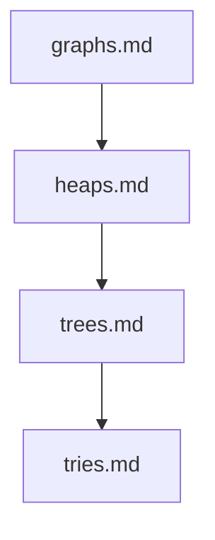

## Folder Map

| Type | Name | Purpose |
| --- | --- | --- |
| File | [graphs.md](graphs.md) | understand graphs |
| File | [heaps.md](heaps.md) | understand heaps |
| File | [trees.md](trees.md) | understand trees |
| File | [tries.md](tries.md) | understand tries |

## Flowchart

# non linear

This README is the navigation index for this folder.
## Next Step

- Go to [graphs.md](graphs.md) to understand graphs.
