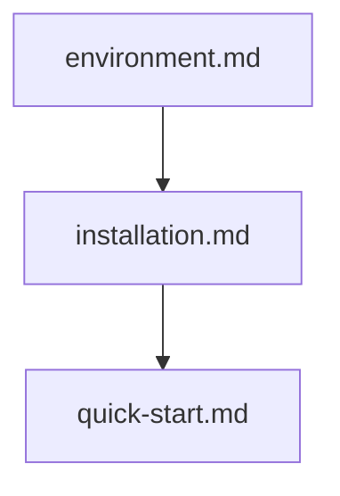

## Folder Map

| Type | Name | Purpose |
| --- | --- | --- |
| File | [environment.md](environment.md) | understand environment |
| File | [installation.md](installation.md) | understand installation |
| File | [quick-start.md](quick-start.md) | understand quick start |

## Flowchart

# getting started

This README is the navigation index for this folder.
## Next Step

- Go to [environment.md](environment.md) to understand environment.
