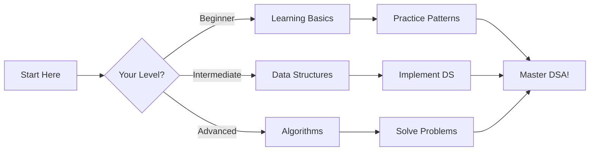

# 🚀 Data Structures and Algorithms

<div align="center">

[](https://opensource.org/licenses/MIT)
[](https://github.com/Codes-RJ/DSA)
[](https://Codes-RJ.github.io/DSA/)

</div>

Welcome to the **Data Structures and Algorithms** comprehensive learning repository! This documentation provides an interactive and enhanced learning experience for mastering DSA concepts.

## 🌟 What You'll Find Here

- 📚 **Comprehensive Theory** - Detailed explanations of every DSA concept
- 💻 **Multi-Language Implementations** - Code in C++, Java, and Python
- 🎯 **Practice Problems** - Progressive exercises to build your skills
- 🔧 **Ready-to-Use Templates** - Competitive programming templates
- 📊 **Visual Learning** - Diagrams, flowcharts, and illustrations

## 🚀 Quick Start

### 1. **Choose Your Learning Path**



### 2. **Set Up Your Environment**

!!! tip "Environment Setup"
    Follow our [Environment Setup Guide](getting-started/environment.md) to configure your development environment with all necessary tools.

### 3. **Start Learning**

- 📖 **[Learning Basics](basics/learning-basics.md)** - Start here if you're new to programming
- 🏗️ **[Data Structures](data-structures/)** - Master the fundamental building blocks
- ⚡ **[Algorithms](algorithms/)** - Learn efficient problem-solving techniques
- 🎯 **[Practice Problems](practice/)** - Apply your knowledge to real problems

## 📋 Learning Roadmap

### Phase 1: Foundation (2-3 weeks)
- [ ] Programming basics
- [ ] Time and space complexity
- [ ] Basic data types and structures

### Phase 2: Core Data Structures (4-6 weeks)
- [ ] Arrays and strings
- [ ] Linked lists
- [ ] Stacks and queues
- [ ] Trees and graphs

### Phase 3: Algorithms (6-8 weeks)
- [ ] Searching and sorting
- [ ] Recursion and backtracking
- [ ] Dynamic programming
- [ ] Greedy algorithms

### Phase 4: Advanced Topics (4-6 weeks)
- [ ] Advanced data structures
- [ ] Graph algorithms
- [ ] Mathematical algorithms

### Phase 5: Practice & Interview Prep (Ongoing)
- [ ] Problem solving
- [ ] Mock interviews
- [ ] Contest participation

## 🎯 Key Features

### 🎨 Interactive Learning
- **Visual diagrams** for complex concepts
- **Step-by-step explanations** with code examples
- **Interactive code blocks** with syntax highlighting
- **Cross-references** between related topics

### 💻 Multi-Language Support
!!! example "Language Examples"
    === "C++"
        ```cpp
        #include <iostream>
        using namespace std;
        
        int main() {
            cout << "Hello, DSA!" << endl;
            return 0;
        }
        ```
    
    === "Java"
        ```java
        public class Main {
            public static void main(String[] args) {
                System.out.println("Hello, DSA!");
            }
        }
        ```
    
    === "Python"
        ```python
        print("Hello, DSA!")
        ```

### 📊 Progress Tracking
- **Checklists** for each topic
- **Difficulty levels** for problems
- **Time complexity** analysis for all algorithms
- **Space complexity** analysis for all data structures

## 🔍 How to Use This Documentation

### Navigation
- Use the **sidebar** to browse topics
- **Search** for specific concepts
- **Previous/Next** buttons for sequential learning
- **Breadcrumbs** to track your location

### Interactive Features
- **Copy code** with one click
- **Toggle dark/light mode** for comfortable reading
- **Expandable sections** for detailed content
- **Mermaid diagrams** for visual learning

### Contributing
!!! info "Want to contribute?"
    - 📝 Edit documentation directly
    - 🐛 Report issues and suggest improvements
    - 💡 Share your knowledge and examples
    - 🤝 Join our community

## 📚 Additional Resources

### 📖 Reference Materials
- [Study Plans](resources/study-plans.md) - Structured learning paths
- [Templates](resources/templates.md) - Ready-to-use code templates
- [References](resources/references.md) - External resources and links

### 🎯 Practice Platforms
- **LeetCode** - Algorithm practice problems
- **HackerRank** - Coding challenges
- **Codeforces** - Competitive programming
- **GeeksforGeeks** - Interview preparation

### 💬 Community
- **GitHub Discussions** - Ask questions and share insights
- **Issues** - Report bugs and request features
- **Pull Requests** - Contribute code and documentation

---

## 🎉 Start Your Journey

Ready to master Data Structures and Algorithms? 

!!! success "Let's begin!"
    Choose your starting point below:
    
    - 🌱 [**I'm new to programming** →](basics/learning-basics.md)
    - 🏗️ [**I know basics, let's learn DS** →](data-structures/)
    - ⚡ [**I know DS, teach me algorithms** →](algorithms/)
    - 🎯 [**I want to practice problems** →](practice/)

<div align="center">

**Happy Learning! 🚀**

[](https://github.com/Codes-RJ/DSA)
[](https://discord.gg/)

</div>
