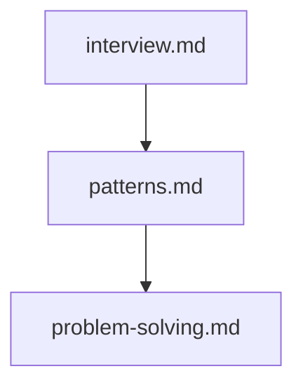

## Folder Map

| Type | Name | Purpose |
| --- | --- | --- |
| File | [interview.md](interview.md) | understand interview |
| File | [patterns.md](patterns.md) | understand patterns |
| File | [problem-solving.md](problem-solving.md) | understand problem solving |

## Flowchart

# practice

This README is the navigation index for this folder.
## Next Step

- Go to [interview.md](interview.md) to understand interview.
