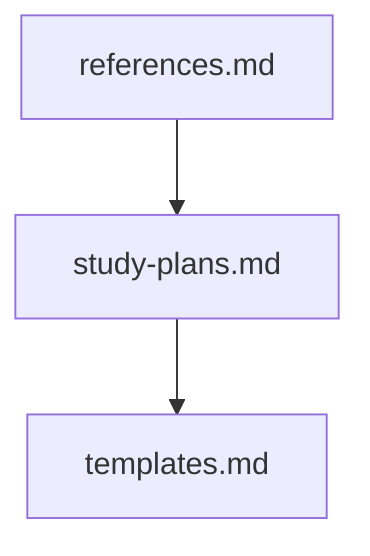

## Folder Map

| Type | Name | Purpose |
| --- | --- | --- |
| File | [references.md](references.md) | understand references |
| File | [study-plans.md](study-plans.md) | understand study plans |
| File | [templates.md](templates.md) | understand templates |

## Flowchart

# resources

This README is the navigation index for this folder.
## Next Step

- Go to [references.md](references.md) to understand references.
